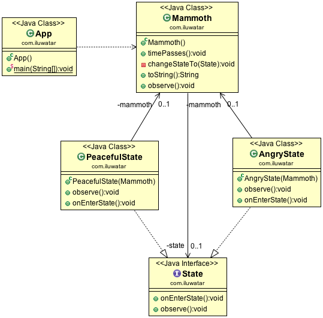

# 状态模式

## 意图
> 当对象内部发生变化时,允许对象改变它的行为.该对象将会改变其类

## 适应场景

* 在以下情况中使用状态模式，对象的行为取决于其状态，并且在运行时
必须根据状态改变其行为

* 在下列情况中，使用状态模式操作有很大的、多部分的条件语句，这些
语句依赖于对象的状态。这个状态通常由一个或多个枚举常量表示。通常，
几个操作将包含相同的条件结构。状态模式将条件的每个分支放在一个单
独的类中。这允许您将对象的状态作为一个对象来处理，它可以独立于其
他对象。