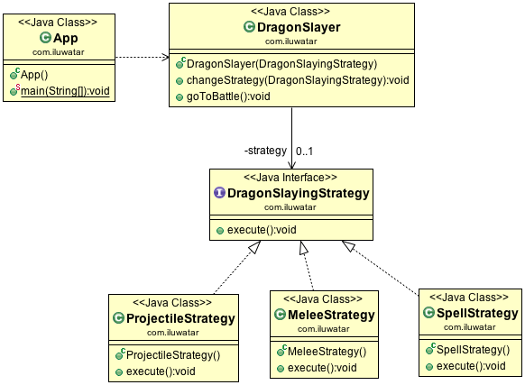

# 策略模式

## 目的

> 定义一系列算法,封装每个算法,并使之可以互换.策略让算法独立于使用它的客户.

## 具体代码

代码见 behavior/strategy包

## 使用场景

* 许多相关的类只在行为上有所不同.策略模式提供了一种类配置成许多行为之一的方法.
* 你需要一个算法的不同变体.例如,你可以定义反映不同空间/时间的算法.当这些变量
实现为类的不同层次结构时,应该使用策略模式
* 算法使用客户端不应该知道的数据。使用策略模式避免暴露复杂的算法特定的数据结构
* 一个类定义了许多行为,这些行为在其操作中表现为多个条件语句.与许多条件不同,将
相关条件分支转移到他们自己的策略类中.

