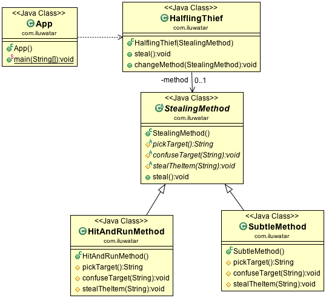

# 模板方法模式

## 目的

> 在操作中定义算法骨架,将一些步骤推迟到子类.模板方法模式允许子类重新
定义算法的某些步骤,而不用改变算法的结构

## 具体代码

见 behaviorType/templateMethod包

## 使用场景

* 模板方法模式应该用于实现算法的不变部分,并将其留给子类来实现可以使用的不变
行为.

* 当不同子类之间有相同的方法是,应该将这些相同的方法分解处理并抽取到一个相同
的类中从而避免代码的复制.这是Opdyke和Johnson所描述的“重构泛化”的好例子.
首先你应该识别出现有代码的差异,然后将差异分离到新的操作中.最后，使用调用其
中一个新操作的模板方法来替换不同的代码

* 模板方法模式用于控制子类的扩张,您可以定义一个模板方法，该方法在特定的点
调用“hook”操作，从而只允许在这些点上进行扩展.