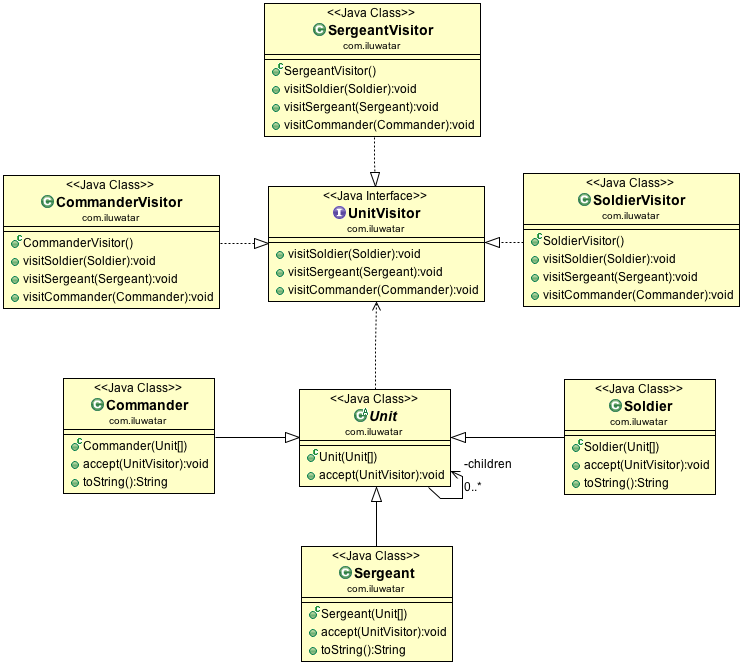

# 访问者模式

## 目的

>表示要在对象结构的元素上进行操作.访问者模式允许你定义一个新的操作,
而不需要更改它所操作元素的类.

具体代码见behaviorType/visitor包

## 适用场景

* 当对象结构包含许多具有不同接口的对象类时，使用访问者模式，并且您
希望对依赖于其具体类的对象执行操作

* 当许多不同且不相关的操作需要在对象结构中的对象上执行事,使用访问者
模式,并且你希望避免使用这些操作"污染"它们的类.访问者可以通过在一个
类中定义它们来保持相关的操作.当许多应用程序共享对象结构时,使用访问
者将操作放在需要它们的应用程序中.

* 当定义对象的类很少发生变化时,但是你通常希望在结构上定义新的操作,
使用访问者模式.更改对象结构类需要重新定义所有访问者的接口.这可能会
带来很大代价.如果对象结构类经常更改,那么最好在这些类中定义操作